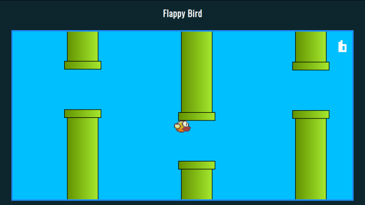

# Flappy
> Um jogo para tentar marcar a maior pontuação sem encostar nos canos.


Um pedaço de jogo desenvolvido em html e JavaScript, apenas para trabalhar conceitos frontend. 



## Instalação

Não é necessario instalar, apenas abrir o arquivo flappy.html no navegador
```

## Exemplo de uso

aperte f5 para recarregar e iniciar.
Segure qualquer tecla para o passarinho subir e solte para ele cair. 

```
